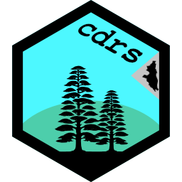

<!-- README.md is generated from README.Rmd. Please edit that file -->

```{r, include = FALSE}
knitr::opts_chunk$set(
  collapse = TRUE,
  comment = "#>",
  fig.path = "man/figures/README-",
  out.width = "100%"
)
```

# cdrs 

<!-- badges: start -->
[](https://lifecycle.r-lib.org/articles/stages.html#experimental)
<!-- badges: end -->

The package {cdrs} (pronounced "cedars") includes functions to aid researchers in analyzing the California Delta Residents Survey (CDRS) of 2023. Please review the [documentation](https://ktomari.github.io/DeltaResidentsSurvey/doc_cdrs_package.html) which is available on the [DRS GitHub homepage](https://ktomari.github.io/DeltaResidentsSurvey/). A guide to install this package is provided in the following section.

*This document was last updated on `r format(Sys.time(), '%B %d, %Y')`.*

## Installation

You can install the development version of cdrs from [GitHub](https://github.com/) with:

``` r
# install.packages("devtools")
devtools::install_github("ktomari/cdrs", build_vignettes = TRUE)
```

The code above not only installs {cdrs}, but also builds the vignettes. Vignettes are R markdown documents that demonstrate the functions in a package. The vignettes currently available in {cdrs} demonstrate the 'basics' and the 'summary_report'. While the vignettes are in draft form and may contain errors, they are a good place to start to begin using {cdrs}. Try them out after you install the package, using the command: `vignette(topic = 'basics', package = 'cdrs')`

## Acknowledgements

I would like to thank Dr. Jessica Rudnick, the Core R Team, the authors of the Tidyverse, the authors of 'R Packages' 2nd Ed. (Wickham and Bryan), Dirk Eddelbuettel et al. for the digest package, and last but not least, Thomas Lumley for the survey package.

Initial funding was provided by Delta Science Program, Delta Stewardship Council (DSC-21143).
